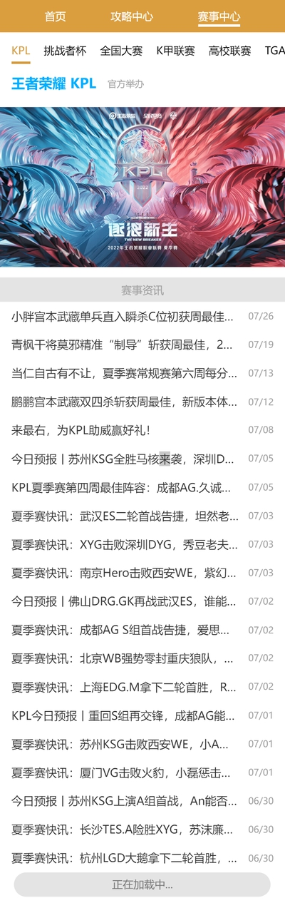
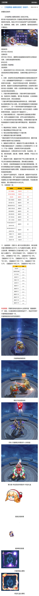

# ```Vue3```仿王者荣耀移动端官网
基于```Vue3+TypeScript+Vite+Vue-Router+Axios+Pinia```开发, 项目还包含了[后台管理系统](https://github.com/ZHOUYIJIEQM/king-admin), [node+express后端](https://github.com/ZHOUYIJIEQM/king-server)

## [点击查看效果, f12后切换到移动端浏览](https://app.yjsjyb.top/kingm)

## <a href="#图片预览">点击预览图片</a>

## 一些记录

### 1. 使用 ```flexible```, 在移动端实现```rem```等比例缩放布局
```
1. 安装
yarn add amfe-flexible
2. 引入
<meta name="viewport" content="width=device-width, initial-scale=1, maximum-scale=1, minimum-scale=1, user-scalable=no">
<script src="./node_modules/amfe-flexible/index.js"></script>
3. 但这样项目打包时的index.html, 没有提取出来, 而是包含
<script src="./node_modules/amfe-flexible/index.js"></script>
没有把amfe-flexible打包出来, 所有直接把"./node_modules/amfe-flexible/index.js"放到一个单独的文件, 然后在main.js里引入
4. 使用时可以在 vscode 下载扩展 px to rem, 打开设置搜索 cssrem, Cssrem: Root Font Size -> 在下方 input 输入设计稿的宽度/10(比如设计稿750, 就输入75), 接下来输入12px, 就会弹出提示转换为rem的对应值
```

### 2. ```Vue3+ts``` 组件传参的写法
1. 写法一
```ts
interface NavBar {
  title: string;
  name: string
}

interface Props {
  // navTitle?: NavBar[],
  // ?表示可选参数
  navTitle?: Array<NavBar>;
  backgroundColor?: string
}

const props = withDefaults(defineProps<Props>(), {
  navTitle: function() {
    return [
      {
        title: '首页',
        name: 'home'
      },
      {
        title: '攻略中心',
        name: 'strategy'
      },
      {
        title: '赛事中心',
        name: 'race'
      }
    ]
  },
  backgroundColor: '#db9e3f'
})
```
2. 写法二
```ts
interface NavBar {
  title: string;
  name: string
}
const props = withDefaults(
  defineProps<
    {
      navTitle?: NavBar[],
      backgroundColor?: string
    }
  >(),
  {
    navTitle: () => [
      {
        title: '首页',
        name: 'home'
      },
      {
        title: '攻略中心',
        name: 'strategy'
      },
      {
        title: '赛事中心',
        name: 'race'
      }
    ],
    backgroundColor: '#db9e3f'
  }
)
```

### 3. 更新了```keep-alive```的写法
```html
<router-view v-slot="{ Component }">
  <keep-alive :exclude="/.*Exclude$/">
    <component :is="Component" />
  </keep-alive>
</router-view>
```

### 4. 缓存组件的同时, 也需要保留组件切换前的滚动高度
```js
// 获取滚动高度,  也可能是记录某个元素的滚动高度
let scrollH = document.documentElement.scrollTop || document.body.scrollTop || window.pageYOffset
// 在离开路由前记录高度
onBeforeRouteLeave((to, from) => {
  // 记录高度
})
// 在keep-alive对应的生命周期函数
onActivated(() => {
  // 恢复记录的高度
})
// 因为多个页面需要用到, 可以提取为组件使用
```

### 5. 使用轮播 ```swiper```, [vue3使用swiper的写法与vue2不太一样, 可以看demo如何配置](https://swiperjs.com/demos)

### 6. 使用全局属性的对象
```js
// vue2 写法
Vue.prototype.msg = 'hello'

// vue3
app.config.globalProperties.msg = 'hello'
const {proxy} = getCurrentInstance()
console.log(proxy.msg)
```

### 7. 使用 [pinia](https://pinia.web3doc.top/introduction.html)
```js
// @/store/strategy.ts
export const strategyStore = defineStore(
  'strategy', 
  {
    state: () => {
      return { heroName: '' }
    },
    getters: { },
    actions: {
      changeHeroName(name: string) {
        this.heroName = name
      }
    }
  }
)

// 在 setup 
import { strategyStore } from "@/store/strategy"
strategyStore().changeHeroName('鲁班七号')
```

### 8. 导航头点击后调整位置, 通过设置父容器的```scrollLeft```, 让选中的标题尽可能保持在中间位置

1. 标题的父容器需设置可以横向滚动```overflow-x: scroll;```
1. 需要获取标题元素的在父容器横向位置(```activeEl.offsfetLeft```), 还有父容器的一半宽度(```navWidth/2```)
1. 当点击的标题```activeEl.offsfetLeft```小于等于父容器一半宽度, 就把父容器的横向位置设置为0
1. 大于一半时, 就需要向左移动以保持在中间位置, 设置父容器的```scrollLeft```为 ```activeEl.offsfetLeft``` 减去一半宽度, 但这样并不是直接居中, 而是最左侧与一半宽度对齐了, 还需要再加上标题的一半宽度 

### 9. 根据后台管理系统里的分类列表, 分出多块区域

## <a id="图片预览">图片预览</a>
<!-- 


 -->

1 首页

2 攻略中心

3 赛事中心

4 英雄详情页

5 皮肤轮播

6 一图识英雄

7 更多英雄

8 视频页

9 文章页


# Vue 3 + TypeScript + Vite

```bash
# 安装依赖
yarn
# 运行
yarn dev
```

This template should help get you started developing with Vue 3 and TypeScript in Vite. The template uses Vue 3 `<script setup>` SFCs, check out the [script setup docs](https://v3.vuejs.org/api/sfc-script-setup.html#sfc-script-setup) to learn more.

## Recommended IDE Setup

- [VS Code](https://code.visualstudio.com/) + [Volar](https://marketplace.visualstudio.com/items?itemName=Vue.volar)

## Type Support For `.vue` Imports in TS

Since TypeScript cannot handle type information for `.vue` imports, they are shimmed to be a generic Vue component type by default. In most cases this is fine if you don't really care about component prop types outside of templates. However, if you wish to get actual prop types in `.vue` imports (for example to get props validation when using manual `h(...)` calls), you can enable Volar's Take Over mode by following these steps:

1. Run `Extensions: Show Built-in Extensions` from VS Code's command palette, look for `TypeScript and JavaScript Language Features`, then right click and select `Disable (Workspace)`. By default, Take Over mode will enable itself if the default TypeScript extension is disabled.
2. Reload the VS Code window by running `Developer: Reload Window` from the command palette.

You can learn more about Take Over mode [here](https://github.com/johnsoncodehk/volar/discussions/471).
